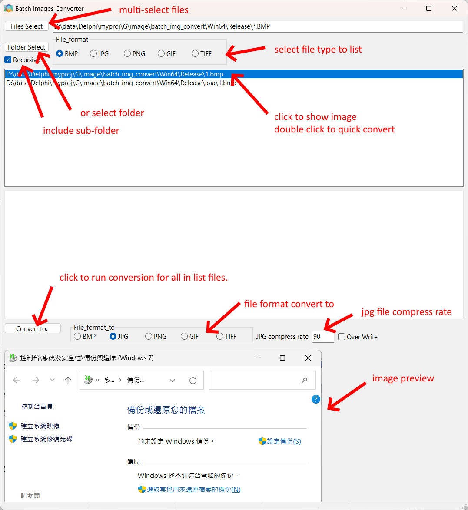

# Batch Image Converter

## Code write by delphi 11.4

## feature

* convert BMP, JPG, PNG, GIF, TIFF file format to
BMP, JPG, PNG, GIF, TIFF file format

* Running under Windows x64 system
* > Convert BMP, JPG, PNG, GIF, TIFF file format  
* > to  
* > BMP, JPG, PNG, GIF, TIFF file format
* batch select files to convert
* Recursive feature

 
